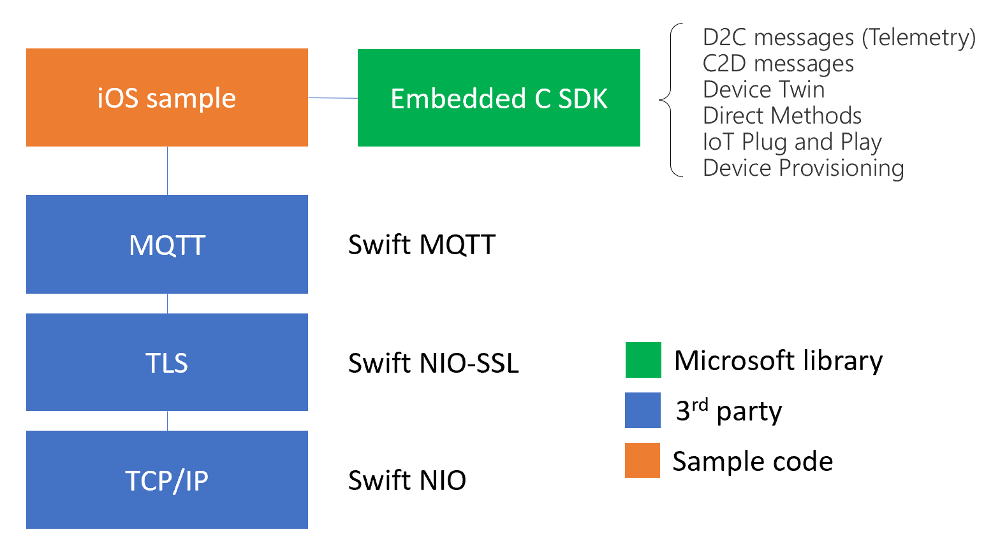

# How to use Azure SDK for C through Swift

This is a sample implementation of the [Embedded C SDK](https://aka.ms/embeddedcsdk) which simplifies the creation of connecting Swift devices to Azure IoT services like Azure Iot Hub and DPS (Device Provisioning Service). 

## Architecture view

The illustration below shows the Swift sample taking a dependence on the Embedded C SDK which provides libraries used to access all Azure IoT functionalities. 

This SDK also implements the BYO (bring your own) network stack approach, which means device builders can choose whichever MQTT client, TLS and TCP stack that works better for their target platform. 

In this case, this sample leverages [Swift MQTT](https://github.com/matsune/swift-mqtt), [Swift NIO-SSL](https://github.com/apple/swift-nio-ssl) and [Swift NIO](https://github.com/apple/swift-nio).



 
## Features

- IoT Hub client
- DPS client (Device Provisioning Service) 
- X.509 cert authentication
- Telemetry messages (D2C - Device to Cloud)
- Commands (C2D - Device to Cloud)

## Prerequisites

The following should be completed before getting the sample running.

- Swift development installed (see below)
- Azure Account
- Device previously created in your IoT Hub or DPS Enrollment.

If you're using **WSL** on Windows with **Ubuntu 20.04**, you can follow the steps below to get Swift working. For all other OS's and additional setup steps, please refer to the official [Swift documentation](https://www.swift.org/).

```bash
# Install Swift on Ubuntu 20.04 LTS x64
# Ewerton Scaboro da Silva, 2022-02-14

apt-get update
apt-get install curl clang libicu-dev git libatomic1 libicu66 libxml2 libcurl4 zlib1g-dev libbsd0 tzdata libssl-dev libsqlite3-dev libblocksruntime-dev libncurses5-dev libdispatch-dev -y
mkdir ~/swift
cd ~swift
wget https://download.swift.org/development/ubuntu2004/swift-DEVELOPMENT-SNAPSHOT-2022-02-03-a/swift-DEVELOPMENT-SNAPSHOT-2022-02-03-a-ubuntu20.04.tar.gz
tar -xvzf ./swift-DEVELOPMENT-SNAPSHOT-2022-02-03-a-ubuntu20.04.tar.gz -C ~/swift
echo 'export PATH="~/swift/swift-DEVELOPMENT-SNAPSHOT-2022-02-03-a-ubuntu20.04/usr/bin:$PATH"' >> ~/.profile
echo 'export PATH="~/swift/swift-DEVELOPMENT-SNAPSHOT-2022-02-03-a-ubuntu20.04/usr/bin:$PATH"' >> ~/.bashrc
export PATH="~/swift/swift-DEVELOPMENT-SNAPSHOT-2022-02-03-a-ubuntu20.04/usr/bin:$PATH" 

```

## Getting Started

Once you have the prerequisites completed:

- Clone the sample repo
- Configure the `Sources/demo/config.swift` file with your credentials
- Add your certificates to the `certs` folder (`client.pem` and `client-key.pem`)
- Build and run the demo:

```swift
swift package clean
swift build
swift run demo
```

## Known Issues and Limitations

- Support for MQTT over WebSockets: Swift MQTT (used in this sample) does not support Web Sockets. [CocoaMQTT](https://github.com/emqx/CocoaMQTT) could be an alternative, since it leverages [StarScream](https://github.com/daltoniam/Starscream). [MQTT-nio](https://github.com/adam-fowler/mqtt-nio) might be an alternative as well. 
- This sample leverages Swift NIO (for network) and Swift NIO-SSL (for TLS) are supported by Apple. Swift MQTT client is a 3rd party library, not created nor supported by Apple.
- No SAS Token utilization is implemented on this sample.
- No reconnection and no retries have been implemented. They need to be implemented by the client application.

## Support

The Swift sample is an open source solution, it is **NOT** a Microsoft supported solution or product. For bugs and issues with the codebase please log an issue in this repo.

## Contributing

If you would like to contribute to the Swift sample, please base your own branch and pull request (PR) off our dev branch.
